# 项目申请书

项目名称：为 Rust-Shyper 集成 RISC-V AIA 中断设备  

项目导师：何若轻

申 请 人 ：程宏豪

邮       箱：chonghao1108@163.com

完成日期：2024年 5月29日

------
[TOC]
------

## 1 项目背景

### 1.1 项目简介

相关背景：

​		Rust-Shyper 是一个使用高级语言Rust编写的面向嵌入式场景的Type-1型虚拟机监视器（Hypervisor）。其设计目标在于提高资源利用率的同时，同时保障虚拟机实时性、隔离性与可靠性的需求。

已有工作：

目前Rust-Shyper已经支持（或正在开发中）的硬件平台：

1. aarch64

   - NVIDIA Jetson TX2

   - Raspberry Pi 4 Model B

   - QEMU (note that VM migration and Hypervisor Live-update is not supported on QEMU)

   - Firefly ROC-RK3588S-PC (note that VM migration and Hypervisor Live-update is not supported on ROC-RK3588S-PC)

2.  RISC-V 

   - QEMU

希望改进的点：本课题希望增加对 RISC-V AIA 高级中断架构的支持。

最终项目实现的目标：增加 RISC-V AIA (APLIC, IMSIC) 设备的支持，相关测试，并合入主线。

### 1.2 项目提出目的

- 原先的PLIC中断控制器设计存在一定的局限性
  - 不能为每个IRQ配置中断属性（比如edge/level triggered)
  - 存在安全问题，M和S模式都能访问MMIO寄存器
  - 不支持MSI
  - 不支持虚拟化中断
- AIA的优势
  - 可以建立基于RISC-V特权架构的中断处理功能，最大限度地减少对现有功能的替换
  - 除了基本的线中断外，还为RISC-V系统提供了直接使用PCI Express和其他设备标准所使用的消息信号中断(MSI)的设施
  - 对于线中断，定义一个新的平台级中断控制器(APLIC)，它对每个权限级别(如RISC-V M和S级别)都有独立的控制接口，并且可以将有线中断转换为MSI中断
  - 在IMSIC中实现了Interrupt file，支持虚拟化中断
  - 可以借助用于重定向MSI的IOMMU，最大限度地提高在虚拟机中运行的Guest直接控制设备的机会和能力，同时最大限度地减少虚拟机管理程序的参与（需实现IOMMU，比较复杂）

### 1.3 项目产出要求

1. 调研 RISC-V AIA，形成 Report，RoadMap
2. 为 Rust-Shyper RISC-V 支持 AIA
   - 支持 APLIC
   - 支持 IMSIC
3. 增加相关单元测试，集成测试
4. 合入主线

### 1.4 项目技术要求

1. 掌握 Rust
2. 熟悉 C (阅读相关的C代码)
3. 了解 虚拟化相关知识
4. 了解 RISC-V

### 1.5 项目相关

项目仓库：https://gitee.com/openeuler/rust_shyper

项目规范：[RISC-V AIA SPEC](https://github.com/riscv/riscv-aia/releases/download/1.0/riscv-interrupts-1.0.pdf)

## 2 项目实现方案

### 2.1 相关技术

#### 2.1.1 AIA架构

AIA主要包含三部分内容

- IMSIC（Incoming MSI Controller）：用来接收和处理MSI中断
- APLIC（Advanced Platform Level Interrupt Controller）：用来接收和处理Wired中断
- 扩展了一部分系统寄存器，扩展了本地中断

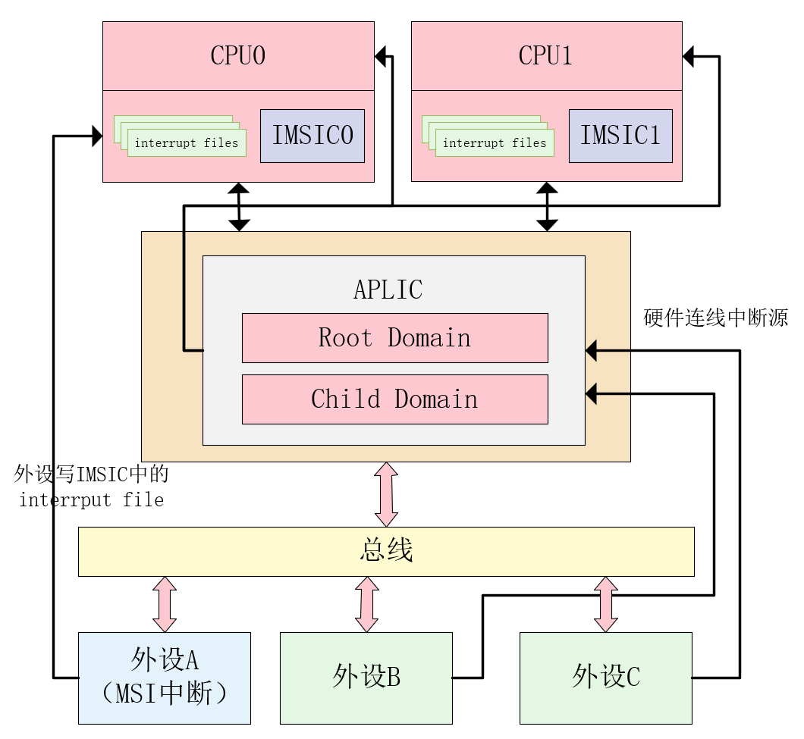

​		上图是AIA的架构图，其中每一个hart上M mode、S mode以及不同的vCPU都有不同的IMSIC interrupt file，每个IMSIC interrupt file对下游设备提供一个MSI 接口。PCIe设备写这个MSI接口会触发MSI中断，APLIC写这个MSI接口也可以触发MSI中断。APLIC作为次一级的中断控制器可以把下游设备的线中断汇集到一个MSI中断上。综上，IMSIC既可以接收支持MSI中断的外设发送的MSI消息，也可以接收APLIC发送的MSI消息，触发中断的方式均为往Interrupt files中去执行写操作。

#### 2.1.2 IMSIC控制器

1. IMSIC概览

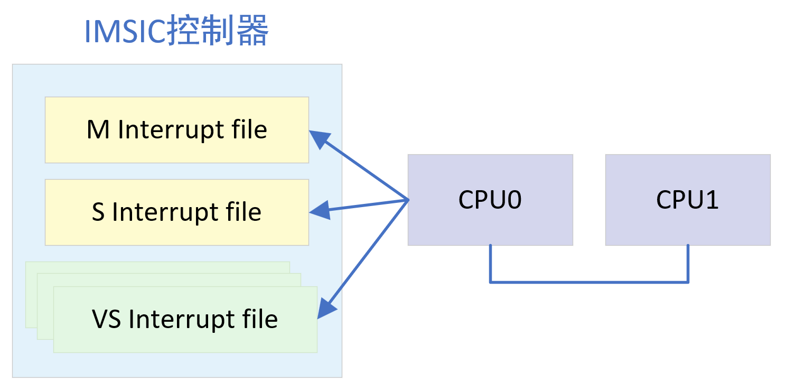

- IMSIC是一个可以独立使用并可以接收MSI的中断控制器
- 每个CPU核心内置一个IMSIC控制器
- 每个IMSIC包含多个中断文件（Interrupt File）
  - 1个M模式的中断文件 
  - 1个S模式的中断文件 
  - 多个VS模式的中断文件
- 每个中断文件4KB大小
  - 通过DTS来告知OS物理地址
- 系统软件通过CSR寄存器来配置中断文件
- 每个中断文件支持2047个中断源

2. 中断文件（Interrupt File）


- 设备（比如PCIe设备）往中断文件的起始地址写数据（DWORD数据，4字节数据），会触发了MSI中断。
- CPU侧一般不直接访问interrupt file的内容，而是通过CSR寄存器间接访问

3. 中断文件起始地址的编码格式


- guest_index_bits：表示一个物理CPU里有多少个vCPU 
- hart_index_bits：表示有多少个物理CPU 
- group_index_bits：表示中断文件存储在多少个组里。多个IMSIC的interrupt file存储 在一起，然后组成一个组，这些interrupt files在一个连续的物理地址空间里

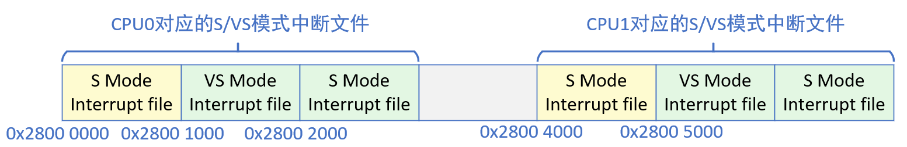

​		假设MSI地址为0x2800 5000，则通过中断文件起始地址的编码格式可以得到guest index为1，hart index为1，说明这个MSI中断是发送给CPU1的第1个虚拟机，所以从Interrupt file base address的编码可以知道这个MSI中断发送给哪个CPU或者vCPU。

4. IMSIC寄存器

- 提供一组AIA CSRs寄存器来让软件访问和配置IMSIC控制器：每个中断文件，有一组系统寄存器
- 访问AIA CSR通过间接访问（indirect register access）的形式
- VS模式下能访问的AIA CSR寄存器区间
  - 0x000-0x02F    reserved
  - 0x030-0x03F    inaccessible
  - 0x040-0x06F    reserved
  - 0x070-0x0FF    reserved
  - 0x100-0x1FF    reserved
- 在系统寄存器里，新增了*iselect  和 *ireg 寄存器来间接访问AIA CSR
- eidelivery寄存器。控制使用中断文件或者APLIC/PIC作为中断源，并传递给CPU
  - 0 = Interrupt delivery is disabled 
  - 1 = Interrupt delivery from the interrupt file 
  - 0x40000000 = Interrupt delivery from a PLIC or APLIC
- eithreshold寄存器。用来设置中断优先级阈值
  - 当eithreshold是P时，中断号P和更高的中断号也不会导致触发中断，不管eie寄存器是否使能该中断
  - IMSIC中断优先级，中断号越小，优先级越高
- eip0 – eip63寄存器：中断待定寄存器
  - 当XLEN=64，奇数eip1，eip3….eip63不存在
  - 每一位表示一个中断源
- eie0 – eie63：中断使能寄存器
- *topei寄存器：用来指示IMSIC里面优先级最高的待定中断源：写入 *toepi寄存器可以把“报告的中断”清除pending bit

5. PCI设备触发MSI中断流程

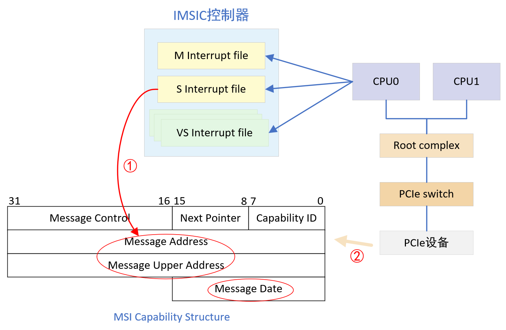

- Linux初始化时会配置MSI  Capability Structure：①把中断文件的HPA写入到message  address寄存器中；②MSI硬件中断号写入到 message data，完成中断注册
- PCI设备若想触发一个中断，需通过写MMIO的方式，按照预先配置，往中断文件base phy address 写中断号

#### 2.1.3 APLIC中断控制器

1. APLIC概览

- APLIC可以单独使用，也可以配合IMSIC使用，如果APLIC配合IMSIC使用，那么APLIC的输出必须被连在IMSIC的输入上，这样APLIC接收到的线中断被转成MSI中断发往IMSIC
- 用来处理wired中断
- 不兼容旧版本PLCI控制器
- 可以配置每个中断源的中断触发类型，中断优先级
- APLIC最大支持中断源的数量是 1023。中断源的ID号从1 ~ 1023
- APLIC发送中断给CPU有两种方式（domaincfg.DM）：
  - Direct mode（0）：直接把中断发送给CPU
  - MSI mode（1）：通过IMSIC控制器发送中断给CPU
- 通过MMIO register访问APLIC控制器
- APLIC的MMIO寄存器
  - 每个中断域有一个4KB对齐，16KB的 MMIO区域（存放各种通用控制寄存器）
  - MMIO区域后面紧挨一组IDC结构，IDC 结构用于直连模式，MSI模式下不需要
    - 每个CPU，一个IDC结构。一个IDC结构 是32个字节。

2. 中断域

- 支持1个或者多个中断域（Interrupt Domains）。这些中断域形成树状分层结构。
  - 只有一个根中断域（Root Interrupt Domain）
  - Wired中断会先进入根中断域
  - 根中断域处于M模式
  - 每个中断域可以选择把全部或者部分中断委托给子中断域（Child  Domain）
  - 虚拟化中子中断域处于VS模式

3. APLIC MMIO寄存器

- domaincfg寄存器。用来配置中断域的
  - IE：全局使能位
  - BE：配置大小端
  - DM：选择模式。0：直连模式 1：MSI模式
- sourcecfg[1]–sourcecfg[1023]寄存器。用来配置每个中断源
  - bit 10，该中断源是否委托给子中断域
    - 被委托：bits 9:0，中断域标识符，标识所委托的子中断域
    - 未被委托：bits 2:0，中断触发模式。Inactive、边沿触发（上升或者下降）、水平触发（高或者低）、detached(通过setip或者setipnum触发)
- mmsiaddrcfg和mmsiaddrcfgh寄存器。用来配置M模式下的MSI地址，用来表示MSI中断要发送到哪个 CPU
- smsiaddrcfg和smsiaddrcfgh寄存器。提供S模式的中断域与MSI地址相关的配置信息
- setip[0]–setip[31]寄存器。设置中断待定位
- setipnum寄存器。通过中断号来设置中断待定位
- clripnum寄存器。通过中断号来清中断待定位
- setie[0]–setie[31]寄存器。设置中断使能位
- setienum寄存器。通过中断号来设置中断使能位
- clrie[0]–clrie[31]寄存器。清中断使能位
- genmsi寄存器。用于APLIC的MSI模式的同步
- target[1]-target[1023]寄存器：用来配置活跃的中断源应该被投送到哪个Hart下的哪个guest

4. APLIC投送模式-直投模式

- domaincfg.DM = 0
  - bits31:18  Hart Index ：CPU编号
  - bits7:0  IPRIO：中断优先级。数值越小，优先级越高。相同优先级的中断源，中断号越小，优先级越高
- 直接投送中断到CPU，通常是有硬件连线
- 直投模式，在MMIO后面有一个IDC结构，每个CPU一个
  - idelivery寄存器。投送总开关
  - iforce寄存器。强制发送中断到CPU，用于测试
  - ithreshold寄存器。设置最小能投送的中断优先级
  - topi寄存器。只读寄存器，返回当前优先级最高的pending状态的中断源
  - claimi寄存器，与topi寄存器类似，不过会清相应中断源的 pending位
- 中断处理过程：

  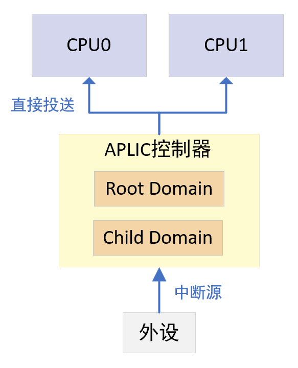

  1. 保存中断上下文
  2. 读取claim寄存器得到中断号i
  3. i = i >> 16
  4. 处理这个中断号为i的中断
  5. 恢复中断上下文
  6. 中断返回

5. APLIC投送模式-MSI模式

- domaincfg.DM = 1
  - bits31:18  Hart Index ：CPU编号
  - bits17:12  Guest Index：如果实现了S模式并且实现了虚拟化，那么Guest Index用来包含0~GEILEN. Guest Index >0，表示发送到那个VS interrupt file，Guest Index = 0，那么只发送到S模式
  - bits10:0  EIID（External Interrupt Identity）：中断号，通常是写MSI地址的 message data
- APLIC需要知道每个CPU上的MSI地址：
  - 芯片设计时进行固定，硬件直接告诉APLIC MSI地址
  - 或者在启动阶段通过* msiaddrcfg*寄存器来配置
- 需要配置target[i]寄存器：表示wired中断要被MSI投送到哪个 CPU中哪个中断文件
- 中断处理过程：

  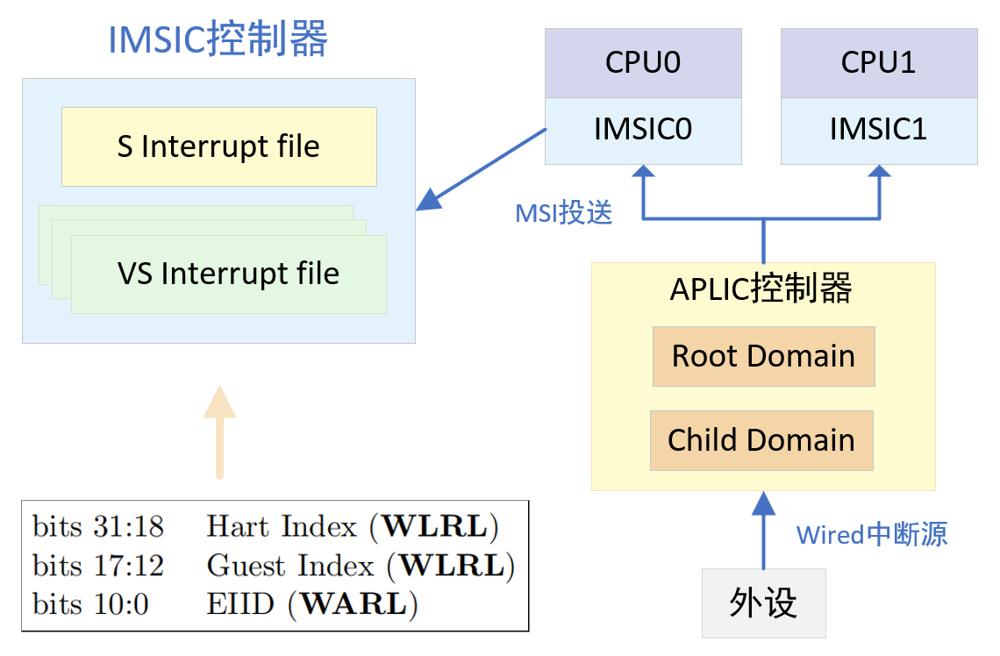

  - 首先需要进行中断注册，配置target[i]寄存器，即第n个wired中断，要发送到哪个CPU，哪个中断文件，MSI中的中断号（EIID）是多少
  - CPU进行中断处理
    1. 保存中断上下文
    2. 读取*topei寄存器获取中断号i，写 *topei寄存器清除pending位
    3. irq = i >> 16
    4. 处理这个中断号为irq的中断
    5. 恢复中断上下文
    6. 中断返回

6. MSI投送模式与APLIC的同步

- APLIC发送MSI中断到CPU，会有一定延时
- 在修改APLIC配置之后，CPU还可能收到之前（配置APLIC之前）的MSI中断
- genmsi：通过配置该寄存器发送一个临时的MSI中断，当CPU判断这个临时MSI中断已经收到了，就可以把旧的MSI丢弃，实现同步

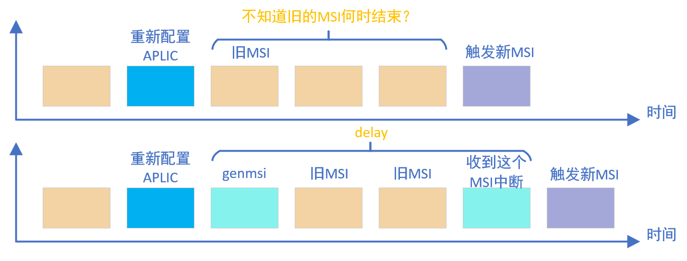

7. APLIC的寄存器与接口设计

```rust
// M-mode APLIC
const APLIC_M: usize = 0xc00_0000;
// S-mode APLIC
const APLIC_S: usize = 0xd00_0000;
// S-mode interrupt delivery controller
const APLIC_S_IDC: usize = 0xd00_4000;

#[repr(u32)]
#[allow(dead_code)]
enum SourceModes {
    Inactive = 0,
    Detached = 1,
    RisingEdge = 4,
    FallingEdge = 5,
    LevelHigh = 6,
    LevelLow = 7,
}

#[repr(C)]
struct Aplic {
    pub domaincfg: u32,
    pub sourcecfg: [u32; 1023],
    _reserved1: [u8; 0xBC0],

    pub mmsiaddrcfg: u32,
    pub mmsiaddrcfgh: u32,
    pub smsiaddrcfg: u32,
    pub smsiaddrcfgh: u32,
    _reserved2: [u8; 0x30],

    pub setip: [u32; 32],
    _reserved3: [u8; 92],

    pub setipnum: u32,
    _reserved4: [u8; 0x20],

    pub in_clrip: [u32; 32],
    _reserved5: [u8; 92],

    pub clripnum: u32,
    _reserved6: [u8; 32],

    pub setie: [u32; 32],
    _reserved7: [u8; 92],

    pub setienum: u32,
    _reserved8: [u8; 32],

    pub clrie: [u32; 32],
    _reserved9: [u8; 92],

    pub clrienum: u32,
    _reserved10: [u8; 32],

    pub setipnum_le: u32,
    pub setipnum_be: u32,
    _reserved11: [u8; 4088],

    pub genmsi: u32,
    pub target: [u32; 1023],
}
#[allow(dead_code)]
impl Aplic {
    /// 设置MSI的目标物理地址
    /// ## Arguments  *`mode`-MSI的模式 (machine or supervisor)   *`addr`-物理地址，必须是合法的
    pub fn set_msiaddr(&mut self, mode: AplicMode, addr: usize) {}
    
    /// MSI模式下设置目标中断发送到哪个hart的哪个guest，并指定中断号
    /// ## Arguments *`irq`-中断号 *`hart`-处理中断的hart  *`guest`-发送到哪个guest  *`eiid`-通常和中断号一样
    pub fn set_target_msi(&mut self, irq: u32, hart: u32, guest: u32, eiid: u32) {}

    /// 直投模式下设置目标中断发送到哪个hart，并设置优先级
    /// ## Arguments *`irq`-中断号 *`hart`-目标hart *`prio`-优先级
    pub fn set_target_direct(&mut self, irq: u32, hart: u32, prio: u32) {}

    /// 不委托给子域时的源配置
    /// ## Arguments *`irq`-中断号 *`mode`-触发模式
    pub fn set_sourcecfg(&mut self, irq: u32, mode: SourceModes) {}

    /// 委托给子域时的源配置
    /// ## Arguments *`irq`-中断号 *`child`-委托的目标子中断域
    pub fn sourcecfg_delegate(&mut self, irq: u32, child: u32) {}

    /// 设置 `domaincfg` 寄存器
    /// ## Arguments *`bigendian`-大小端设置 *`msimode`-是否启用msi模式 *`enabled`-使能位
    pub fn set_domaincfg(&mut self, bigendian: bool, msimode: bool, enabled: bool) {}

    /// 设置中断的使能
    /// ## Arguments *`irq`-中断号 *`enabled`-true: 使能中断, false: 禁止中断
    pub fn set_ie(&mut self, irq: u32, enabled: bool) {}

    /// 设置中断的pedding位
    /// ## Arguments *`irq`-中断号 *`pending`-true: 置为1, false: 置为0
    pub fn set_ip(&mut self, irq: u32, pending: bool) {}
}

/// IDC结构体，用于APLIC的直投模式下
#[repr(C)]
struct InterruptDeliveryControl {
    pub idelivery: u32,
    pub iforce: u32,
    pub ithreshold: u32,
    pub topi: u32,
    pub claimi: u32,
}
```

#### 2.1.4 AIA虚拟化硬件支持

- 每个vCPU有一个guest interrupt file。一个物理CPU可以有多个vCPU
- hstatus.VGEIN字段指示 当前vcpu使用哪个guest中断文件
- 使用vsiselect和vsireg访问guest中断文件对应的CSRs寄存器（offset为0x7F ~ 0xFF）
- hypervisor可以通过vsiselect和vsireg寄存器去设置guest中断文件对应的pending位来注入一个MSI中断到虚拟机
- AIA不提供虚拟APLIC/PLIC的支持
  - 需要在hypervisor里模拟即trap-and-emulate
  - 对于MSI投送模式，中断处理不需要trap到hypervisor


### 2.2 技术细节

#### 2.2.1 虚拟化下中断架构

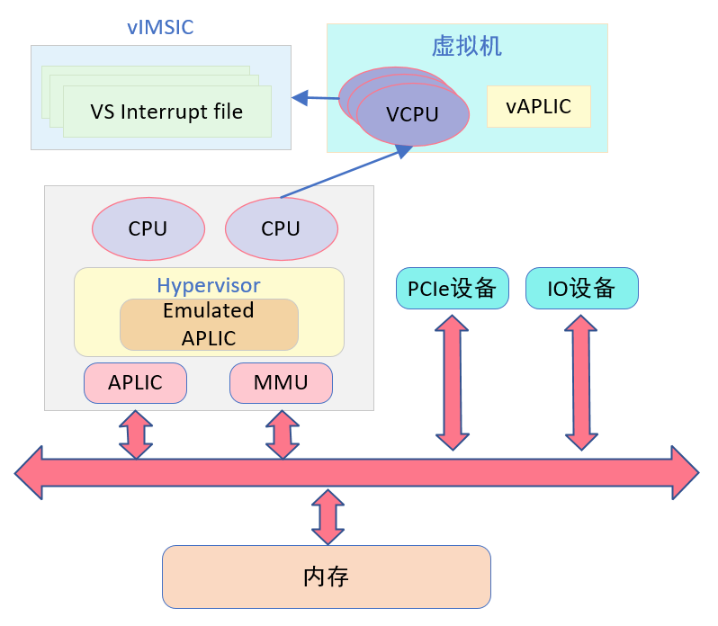

​		如上图所示，该图描述的是在虚拟化场景下中断架构的设计，由于AIA不支持APLIC的虚拟化，所以需要在hypervisor中去模拟APLIC，模拟后虚拟机才能感知到有APLIC控制器，虚拟机的软件去配置或访问APLIC时，会触发IO的缺页异常陷入到hypervisor中，hypervisor中需要去模拟VM的IO操作，把中断配置成MSI投递方式，并配置物理APLIC的其他信息，让中断源直接发送MSI到vCPU的Interrupt file，当有中断发生时，会自动投送到指定的vCPU中。而PCIe设备是在Linux初始化的时候就已经设置好了MSI的配置空间，在MSI Capabilitiy结构中写好了msi是向哪个地址写什么数据，所以后面PCIe设备中断触发的时候，就按照一开始配置好的，向指定地址写入指定数据，触发MSI中断。

#### 2.2.2 注入中断方式

- 传统方式：外部中断通过hvip.VSEIP字段来注入到虚拟机
- Host发MSI到vCPU
  - vCPU必须有guest interrupt file
  - hypervisor通过vsiselect和vsireg寄存器去设置guest interrupt file对应的pending位来注入一个MSI中断到虚拟机。
- Wired中断源要注入到VM：假设VM里有一个vAPLIC，当VM配置vAPLIC让这个中断源采用MSI投递模式来发送给 vCPU。那么hypervisor需要配置物理APLIC，让这个中断源，直接发送MSI到vCPU的中断文件中。
- 在VM里的外设自己触发MSI中断：必须有IOMMU支持，VM的设备写MSI地址，必须由IOMMU来转换这个地址从GPA到 HPA

> todo：最后一条暂定？需要IOMMU支持，比较复杂

#### 2.2.3 VS模式下主中断优先级配置

- 可以配置VS模式下主中断优先级，hypervisor通过hviprio1和hviprio2寄存器

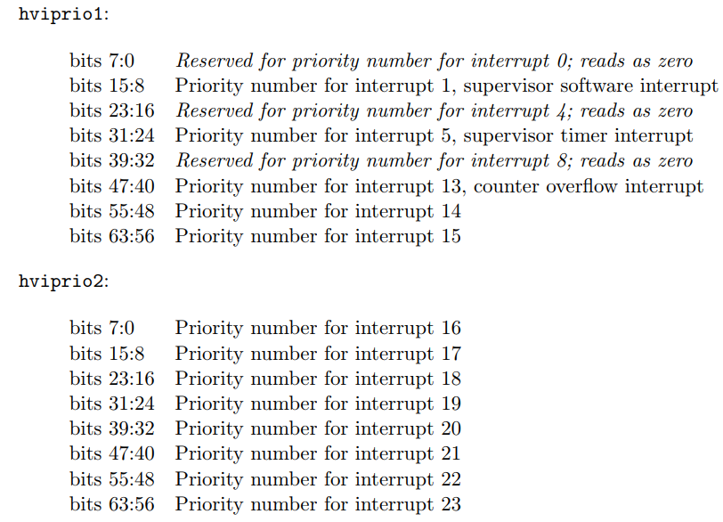

- 可配置的主中断主要有3个

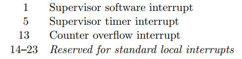

#### 2.2.4 IPI支持

- 多核系统中，CPU向另一个CPU发出中断
- 早期采用software interrupt 的方式来实现IPI
  - 缺点：需要陷入到M模式
- AIA选择采用MSI机制来实现IPI：从一个CPU向另一个CPU发送MSI中断

#### 2.2.5 qemu 运行 linux riscv with AIA（APLIC&IMSIC）

- qemu版本：v7.2.0
- opensbi版本：v1.2
- kernel版本：v6.8.0-rc5
- rootfs版本：ubuntu-base-20.04.5-base-riscv64

运行命令：

```shell
qemu-system-riscv64 \
    -M virt,aclint=on,aia=aplic-imsic \
    -nographic \
    -smp 8 \
    -m 8G \
    -bios fw_jump.elf \
    -kernel ./Image \
    -append "root=/dev/vda rw console=ttyS0" \
    -drive file=ubuntu_riscv64.img,if=none,format=raw,id=hd0 \
    -device virtio-blk-device,drive=hd0
```

参数解释：

- aia=[none|aplic|aplic-imsic]：“aia=aplic”选择 APLIC来处理硬连线中断。而“aia=aplic-imsic”选择 APLIC 和 IMSIC来处理硬连线中断和MSI。当未指定时，这个选项默认被假定为“none”，此时会选择SiFive PLIC来处理硬连线中断
- aia-guests=nnn：对于选择了“aia=aplic-imsic”的虚拟机，这个选项指定每个HART的VS级别的AIA IMSIC页面数量要被模拟。如果没有指定，则每个HART VS级别的默认AIA IMSIC页面数量为0。

运行结果：

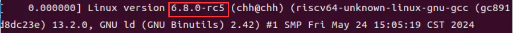

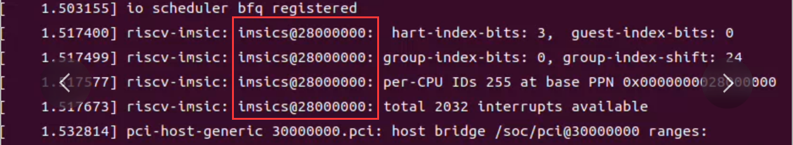

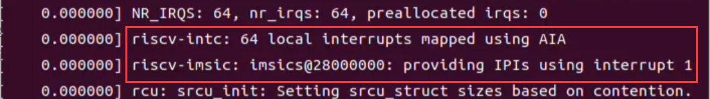

在linux查看设备树：

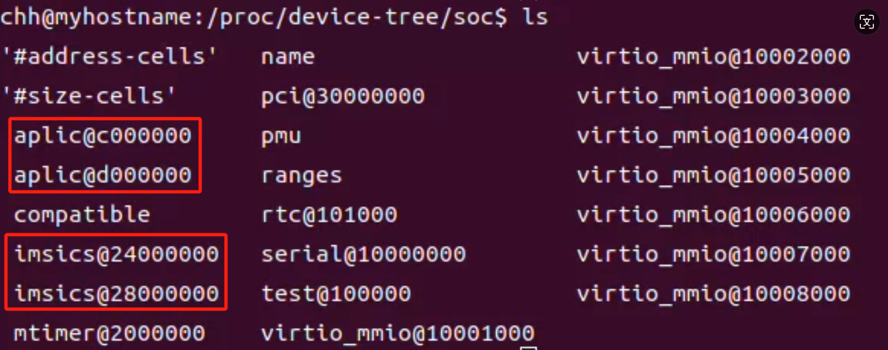

结论：

​		该设备树是qemu自动传给linux内核的，由以上所有运行结果可以得出AIA成功加载进了LIinux内核。由此，我们在虚拟化开发中可以使用该版本的qemu去运行支持AIA的Linux内核来作为VM。

#### 2.2.6 AIA中断实现方式总结

> todo：需要确定原系统中的SBI是否是OpenSBI1.2？不是则需要更换或者升级
>
> 原因：从OpenSBI版本介绍中了解到，从v1.2开始正式支持RISC-V AIA，RustSBI中没有看到AIA相关信息
>
> 现状：Rust-Shyper内部模拟SBI用的是RustSBI的crate，Rust-Shyper外部与M-mode通信的接口目前用的是OpenSBI，具体替换方案还需进一步调研与测试

1. 先在系统中实现APLIC，并在Hypervisor中去模拟APLIC，让系统可以支持线中断，用来替代系统中的PLIC
2. 加入IMSIC，为实现MSI投递中断，需要在IO缺页异常处理方式中增加有关APLIC缺页的处理方式，对于MSI的投递，可以通过target_msi函数设置相应中断号的情况：发送到哪个hart的哪个guest，并写入中断号，并通过setmsiaddr函数中设置的IMSIC的地址配合去写相应的中断文件去触发中断。
3. IPI中断需采用MSI机制来实现，以替代系统中通过software interrupt实现IPI中断的方式
   - 当实现了IMSIC后，可以往目标CPU写入MSI
   - 当CPU0触发IPI，会分别往所有CPU上的S模式的interrupt file写MSI data

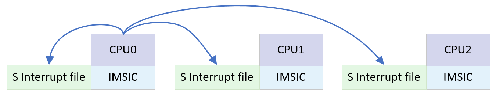


## 3 项目规划

### 3.1 第一阶段（7.1-8.25）

- [ ] 6月4日-6月30日：熟悉关于Type-1类RISC-V Hypervisor的相关实现
- [ ] 7月1日-7月7日：熟悉Rust-Shper代码，主要对代码中的中断与异常处理过程进行理解
- [ ] 7月8日-7月21日：实现APLIC的直投方式，能够代替PLIC处理wired中断，并进行相关测试
- [ ] 7月22日-8月11日：实现APLIC的MSI投递方式，并加入IMSIC，并进行相关测试
  - [ ] 实现有线中断通过APLIC发送MSI中断到IMSIC
  - [ ] 实现PCIe设备发送MSI中断到IMSIC
- [ ] 8月12日-8月25日：在系统增加了AIA后，对MSI投递方式下的IPI中断的支持进行测试，并解决相关的问题

### 3.2 第二阶段（8.26-9.30）

- [ ] 对第⼀阶段代码进行完善，并解决第⼀阶段中遇到的问题
- [ ] 对第⼀阶段完成的内容进行更详细的测试，并修改BUG
- [ ] 对第⼀阶段的完成内容进行总结，并输出相关文档内容
- [ ] 思考可以改进或者补充的地方

> 注：开发中需要每周向导师汇报进度，沟通细节
